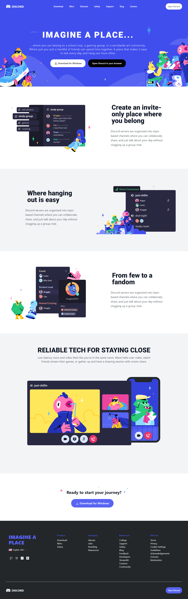
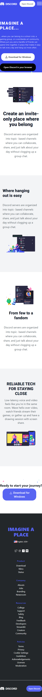

# Discord Clone    
 
  
 This is a `resposnive` Discord clone made for learning purposes using `tailwind css`. 

Made by - **Robin Khilery** 

***
 
 

 ## Deployed Link
 [click here to see deployed version](https://discordclonelink.netlify.app/ "Click to Visit Link") 
   

## Screenshots

### Laptop View

### Mobile View

 